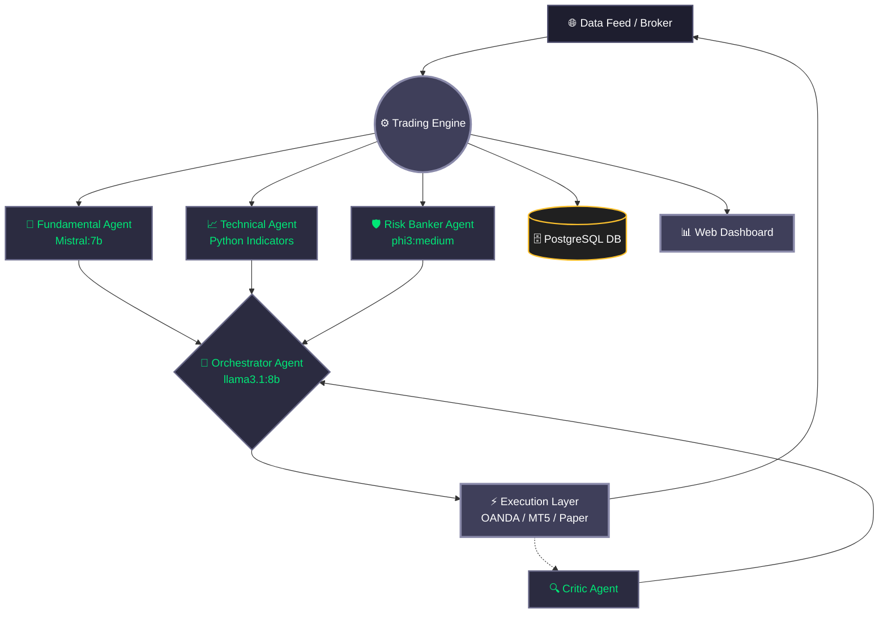
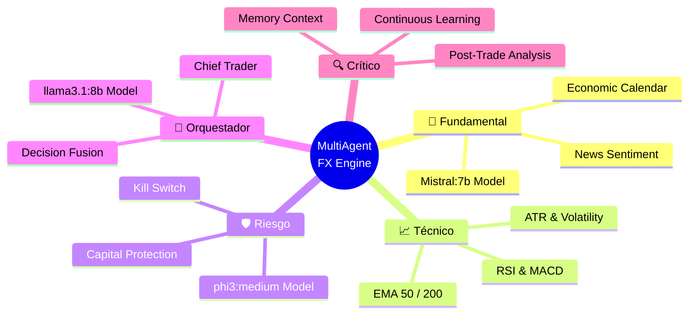

<div align="center">

# 🌌 MultiAgent FX Engine

**A Professional Multi-Agent Artificial Intelligence Trading System for Forex.**

[](https://python.org)
[](https://opensource.org/licenses/MIT)
[]()
[]()

*Inteligencia Artificial distribuida para análisis, riesgo y ejecución en mercados de divisas.*

---

</div>

## 📖 ¿Qué es MultiAgent FX Engine?

**MultiAgent FX Engine** es un sistema de trading automatizado de grado institucional diseñado para operar en el mercado Forex (ej. EUR/USD). Utiliza una arquitectura basada en **múltiples agentes de Inteligencia Artificial locales (Ollama)**, donde cada agente tiene una especialidad única (Fundamental, Técnico, Riesgo). Un agente orquestador central (Chief Trader) fusiona esta información para tomar decisiones precisas de compra, venta o espera (HOLD).

Este enfoque emula el funcionamiento de una mesa de trading profesional:
- 📰 **Analista Fundamental**: Interpreta noticias y eventos económicos.
- 📈 **Analista Técnico**: Calcula indicadores matemáticos y tendencias de precio.
- 🛡️ **Gestor de Riesgos**: Protege el capital y define tamaños de posición.
- 🧠 **Orquestador**: Toma la decisión final basándose en la información de su equipo.
- 🔍 **Crítico**: Aprende de las operaciones pasadas para mejorar las futuras.

---

## 🏗️ Arquitectura del Sistema

El flujo de información y la toma de decisiones se distribuyen de manera asíncrona para máxima eficiencia y seguridad.



---

## 🧠 Ecosistema de Agentes

Cada agente cumple una función vital, operando de manera aislada pero reportando al orquestador.



---

## ✨ Características Principales

- **🤖 LLMs Locales Privados**: Usa Ollama (llama3.1, mistral, phi3) para procesamiento en la misma máquina, garantizando privacidad total y 0 coste en APIs.
- **🛡️ Kill-Switch de Seguridad**: El Agente de Riesgo puede vetar y detener cualquier operación (HOLD) si detecta condiciones adversas, sin que el Orquestador pueda anularlo.
- **💼 Múltiples Brokers Soportados**:
  - **Paper Trading** (Simulado, integrado)
  - **OANDA** (vía API)
  - **MetaTrader 5 (MT5)** (Integración nativa)
- **📊 Dashboard en Tiempo Real**: Visualización del estado del mercado, decisiones del sistema y balance en una interfaz web o en la terminal (Rich).
- **🗄️ Auditoría Total (PostgreSQL)**: Todas las decisiones, razones de los LLMs, trades y eventos de sistema se registran y respaldan automáticamente.

---

## 🚀 Requisitos Previos

Antes de instalar, asegúrate de tener:

1. **Python 3.9+**
2. **PostgreSQL**: Base de datos para el historial.
3. **Ollama**: Instalado y corriendo localmente (descarga en [ollama.ai](https://ollama.ai)).
   ```bash
   # Descarga de los modelos requeridos:
   ollama run llama3.1:8b
   ollama run mistral
   ollama run phi3
   ```

---

## 🛠️ Instalación y Configuración

**1. Clonar el repositorio:**
```bash
git clone https://github.com/murdok1982/MultiAgent-FX-Engine.git
cd MultiAgent-FX-Engine
```

**2. Crear un entorno virtual e instalar dependencias:**
```bash
python -m venv venv
source venv/bin/activate  # En Windows: venv\Scripts\activate
pip install -r requirements.txt
```

**3. Configurar variables de entorno:**
Copia el archivo de ejemplo y configura tus credenciales.
```bash
cp .env.example .env
```

Edita `.env` con tus credenciales de base de datos y broker:
```env
# Ejemplo de configuración
TRADING_MODE=PAPER  # Opciones: PAPER, LIVE
TRADING_SYMBOL=EUR_USD
BROKER_TYPE=PAPER   # Opciones: PAPER, OANDA, MT5

# Base de datos
DB_USER=postgres
DB_PASSWORD=tu_password
DB_HOST=localhost
DB_PORT=5432
DB_NAME=multiagent_fx
```

---

## 💻 Uso

El sistema puede ejecutarse en varios modos. **Por defecto, siempre arranca en modo seguro (Paper Trading).**

**Modo Simulado (Paper Trading - Seguro):**
```bash
python main.py
```

**Modo Prueba de un solo ciclo (Dry Run):**
Ejecuta un análisis completo y muestra la decisión del Orquestador sin realizar ninguna operación.
```bash
python main.py --dry-run
```

**Modo Real (LIVE TRADING):**
*Advertencia: Requiere doble confirmación interactiva para prevenir accidentes.*
```bash
python main.py --live
```

---

## ⚠️ Advertencia de Riesgo (Disclaimer)

**TRADING SYSTEM — CRITICAL RISK WARNING**

Este sistema es experimental y puede perder dinero real.
El mercado Forex es altamente volátil. El uso de este software en modo `LIVE` bajo brokers reales es bajo **TU PROPIA RESPONSABILIDAD**.
Ningún rendimiento pasado o resultado en papel (Paper Trading) garantiza ganancias futuras. El autor no se hace responsable por ninguna pérdida financiera, daño de software o hardware asociado al uso de este repositorio.

---

## 🎁 Licencia y Donaciones

Este proyecto se distribuye bajo la licencia **MIT** y es completamente **gratuito para su uso**, modificación y distribución.

Si este sistema te resulta útil para tu aprendizaje, investigación o proyectos personales/comerciales, **agradeceríamos enormemente una donación**. Tu apoyo ayuda a mantener estos proyectos de código abierto activos, pagar servidores de prueba y continuar investigando en Inteligencia Artificial aplicada.

### Bitcoin

┏━━━━━━━━━━━━━━━━━━━━━━━━━━━━━━━━━━━┓
┃  ₿  Bitcoin Donation Address  ₿   ┃
┣━━━━━━━━━━━━━━━━━━━━━━━━━━━━━━━━━━━┫
┃                                   ┃
┃   bc1qqphwht25vjzlptwzjyjt3sex    ┃
┃   7e3p8twn390fkw                  ┃
┃                                   ┃
┗━━━━━━━━━━━━━━━━━━━━━━━━━━━━━━━━━━━┛

**Red:** Bitcoin (BTC)
**Dirección:** `bc1qqphwht25vjzlptwzjyjt3sex7e3p8twn390fkw`

*Copia la dirección arriba indicada en tu wallet preferida.*

---
<div align="center">
<i>Desarrollado con pasión por la IA y los sistemas complejos.</i>
</div>
