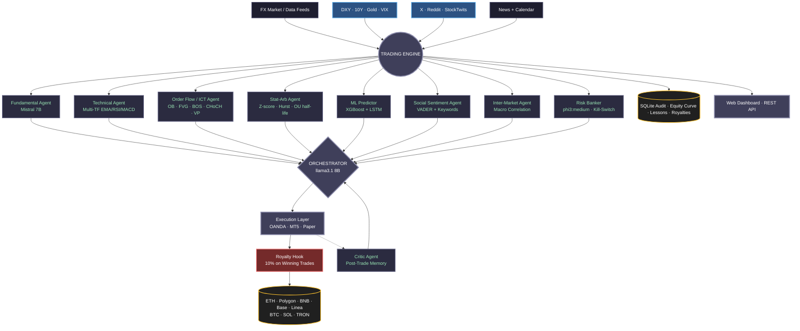

<div align="center">

# MULTIAGENT FX ENGINE

### Institutional-Grade Multi-Agent AI Trading System for the Foreign Exchange Market

`v2.0 — Smart-Money Edition`

[](https://python.org)
[](LICENSE-COMMERCIAL.md)
[]()
[]()

*An asynchronous, multi-agent AI architecture for analysis, risk control,
prediction and execution across the FX market.*

---

</div>

## I. EXECUTIVE SUMMARY

**MultiAgent FX Engine** is an institutional-grade automated trading
system for the foreign exchange market (primary pair: EUR/USD). The
system is composed of **ten specialised agents** coordinated by an LLM
Chief Trader. Each agent owns a single epistemic domain — fundamental,
technical, smart-money, statistical, predictive, sentiment, macro,
risk, execution, post-mortem — and reports its view to the orchestrator,
which fuses them into a single auditable decision.

The system runs in two modes:

- **PAPER** — fully simulated, no real capital at risk. Free under the
  original MIT license.
- **LIVE** — places real orders on a real broker. Requires a
  **Commercial License Key** (see Section IX).

---

## II. SYSTEM ARCHITECTURE



---

## III. AGENT ECOSYSTEM

| # | Agent | Domain | Engine | Output |
|---|-------|--------|--------|--------|
| 1 | **Fundamental** | News + Calendar sentiment, central-bank divergence | Mistral 7B | BULLISH / BEARISH / NEUTRAL + score |
| 2 | **Technical** | Multi-TF EMA/RSI/MACD, ATR adaptive SL/TP, regime, session filter | Pure Python | Trend + entry signal + strength |
| 3 | **Order Flow / ICT** | Order Blocks, Fair Value Gaps, BOS, CHoCH, liquidity sweeps, Volume Profile (POC/VAH/VAL), premium/discount | Pure Python | Smart-money bias + confluence score |
| 4 | **Stat-Arb** | Mean-reversion via z-score, %B, Hurst exponent, OU half-life | Pure Python | Fade signal when |z|≥2 and H<0.5 |
| 5 | **ML Predictor** | Next-bar return classifier; 17-feature vector + sequence model | XGBoost / LSTM | P(up) + confidence + expected bps |
| 6 | **Social Sentiment** | X (Twitter), Reddit, StockTwits aggregation; contrarian on extremes | VADER + FX-keyword | Score [-1,+1] + crowd-extreme fade |
| 7 | **Inter-Market** | DXY, US 10Y/30Y, EU 10Y, Gold, Crude, VIX correlation | yfinance + derived | Macro bias + risk regime |
| 8 | **Risk Banker** | Position sizing, daily DD, consecutive losses, kill-switch | Deterministic | Veto authority (cannot be overridden) |
| 9 | **Orchestrator** | Decision fusion; treats stat-arb as fade, social as contrarian, confluence as boost | llama3.1 8B | BUY / SELL / HOLD + confidence + reasoning |
| 10 | **Critic** | Post-trade error classification, memory injection, adaptive parameter tuning | llama3.1 8B | Lesson + parameter delta |

---

## IV. DECISION FUSION RULES

Hard rules enforced **before** the LLM is even called:

1. `Risk.trading_allowed == False` → forced `HOLD` (cannot be overridden by orchestrator).
2. `Fundamental.trading_allowed == False` (high-impact event window) → forced `HOLD`.
3. `confidence < MIN_CONFIDENCE_THRESHOLD` (default 0.65, adaptive) → forced `HOLD`.

LLM-side soft rules:

- Never trade against both Fundamental AND Technical simultaneously.
- Confluence across Technical + Order Flow + ML + Inter-Market boosts confidence.
- Extreme social consensus is interpreted as a **fade** signal.
- Stat-Arb fade only acted upon when trend regime is sideways/weak.

---

## V. LEARNING & ADAPTATION

The system does not "learn" in the deep-RL sense; instead it adapts on
two distinct levels:

**Episodic memory (Critic Agent).** Every closed trade is post-mortem-ed
by `CriticAgent`, which writes a structured lesson to `critic_lessons`
(error type + actionable improvement). The orchestrator receives the
most recent 5 lessons injected (sanitised) into its prompt on every
new cycle, so prior mistakes directly shape new decisions.

**Adaptive parameter tuning.** After every 10+ closed trades, the
Critic recalculates win-rate and profit factor, then walks `dynamic_params`
inside hard safety bounds:

- `sl_multiplier` ∈ [0.5, 3.0] — widens after losing streaks.
- `tp_multiplier` ∈ [0.5, 5.0] — extends when wins are too small.
- `min_confidence_threshold` ∈ [0.4, 0.95] — tightens after poor periods.

**Predictive learning (ML agent).** The XGBoost head retrains on demand
when no model artefact exists; the LSTM head trains a sequence model
over the last 32 bars × 17 features. Both heads are deterministic
classifiers — they bias the orchestrator but never execute on their own.

---

## VI. INSTALLATION

### A. Prerequisites

| Component | Why it matters |
|---|---|
| Python 3.9+ | Core runtime |
| Ollama (local) | Privacy-first LLM inference — no API costs |
| 16 GB RAM minimum | Concurrent LLM loading + ML inference |
| Optional: GPU | Speeds up LSTM training (CPU works too) |

### B. Setup

```bash
git clone https://github.com/murdok1982/MultiAgent-FX-Engine.git
cd MultiAgent-FX-Engine

# Virtual environment
python -m venv venv
source venv/bin/activate          # Windows: venv\Scripts\activate

# Core install
pip install -r requirements.txt

# Ollama models
ollama pull llama3.1:8b
ollama pull mistral
ollama pull phi3
```

### C. Configuration

```bash
cp .env.example .env
# Open .env in your editor and fill the relevant sections
```

**Minimum viable `.env` for PAPER mode:**

```env
TRADING_MODE=PAPER
PAPER_CAPITAL=10000.0
TRADING_SYMBOL=EUR_USD
ACTIVE_BROKER=paper
```

**For LIVE mode, also set:**

```env
COMMERCIAL_LICENSE_KEY=<your key>
ROYALTY_PREFERRED_CHAIN=polygon
ROYALTY_USER_PRIV_KEY=<your wallet private key>
ROYALTY_USER_ADDRESS=<your wallet public address>
ROYALTY_NATIVE_PER_USD_POLYGON=1.25
OANDA_API_KEY=<your oanda key>
OANDA_ACCOUNT_ID=<your account>
ACTIVE_BROKER=oanda
```

---

## VII. USAGE

| Command | Mode | What it does |
|---|---|---|
| `python main.py` | Paper | Default safe mode, no real orders |
| `python main.py --dry-run` | Paper | One full analysis cycle, no orders |
| `python main.py --interval 5` | Paper | Cycle every 5 minutes |
| `python main.py --live` | **Live** | Real orders — requires license + integrity + double confirmation |
| `python main.py --no-dashboard` | — | Disable the live Rich dashboard |
| `python main.py --reset-kill-switch` | — | Manually reset the kill-switch before start |

**Web Dashboard:** once running, browse to `http://localhost:8080`
for the real-time view of decisions, balances, and active positions.

**Backtest:** see `backtesting/runner.py` for a CLI replay over
historical OHLCV (yfinance).

---

## VIII. AVAILABLE BROKERS

| Broker | Type | Notes |
|---|---|---|
| Paper | Simulated | Built-in. Tracks SL/TP, fills at mid + spread. |
| OANDA | REST v20 | Practice + live environments |
| MetaTrader 5 | Native bridge | Windows only |
| Interactive Brokers | (planned) | Via `ib_insync` |

---

## IX. COMMERCIAL LICENSE & ROYALTY

This software is dual-licensed:

- **PAPER mode** is free under the original MIT License (`LICENSE`).
- **LIVE mode** is governed by `LICENSE-COMMERCIAL.md`.

### The 10% Royalty

For every closed trade with **net profit > 0**, ten percent of that
profit is paid to the author's wallets via the chain selected in
`ROYALTY_PREFERRED_CHAIN`. **Losing trades pay nothing.** PAPER mode
logs the obligation but transfers nothing.

### Author Payout Addresses

| Chain | Address |
|---|---|
| Ethereum / Linea / Base / BNB / Polygon (EVM) | `0x2720705E09a049F2F029090292e4626b72fCf4F9` |
| Bitcoin (native segwit) | `bc1qdjg5sa7hnn0hcktxeexp6sscaktwlx8ql0cd53` |
| Solana | `CTFUHHjbjZWCgki4EhmeNvxENHVzN1sYm64DPFKoUoH6` |
| TRON | `TG7rBDuf8uCawAwLdPknZuKtNgoGW6wQaP` |

All addresses are also published in `royalty/royalty.py` (`AUTHOR_WALLETS`)
and are verifiable on-chain.

### Anti-Tampering

`royalty/integrity.py` computes the SHA-256 of `royalty/royalty.py` on
every system start in LIVE mode. If the hash does not match the
pinned reference, **LIVE mode is refused** and the system falls back
to PAPER. PAPER mode is always unaffected.

### How to Obtain a Commercial License Key

Send a request to **gustavolobatoclara@gmail.com** with:

1. Your full name or legal entity.
2. Intended deployment (personal / firm / fund).
3. Broker(s) and approximate capital.

You will receive a `COMMERCIAL_LICENSE_KEY` to place in your `.env`.

Full terms: see [`LICENSE-COMMERCIAL.md`](LICENSE-COMMERCIAL.md).

---

## X. SECURITY & RISK CONTROLS

- **Kill-Switch.** Triggered automatically on daily drawdown breach
  or N consecutive losses. Only resettable manually.
- **No-Trade Windows.** Fundamental agent blocks trading around
  high-impact macro events.
- **Session Filtering.** Trading restricted to European / American
  sessions; quality multiplier penalises Asian-session signals.
- **Prompt Injection Hardening.** All free-text fields stored in DB
  are sanitised before being injected into LLM prompts.
- **Audit Trail.** Every agent decision, trade, kill-switch event,
  parameter change and royalty obligation is persisted to SQLite
  with automatic timestamped backups every 6 hours.

---

## XI. DIRECTORY LAYOUT

```
MultiAgent-FX-Engine/
├─ agents/
│  ├─ fundamental.py        News + calendar (Mistral 7B)
│  ├─ technical.py          Multi-TF indicators + regime
│  ├─ order_flow.py         ICT / Smart Money / Volume Profile
│  ├─ stat_arb.py           Z-score + Hurst + OU half-life
│  ├─ ml_predictor.py       XGBoost + LSTM
│  ├─ social_sentiment.py   X / Reddit / StockTwits
│  ├─ intermarket_agent.py  DXY / Bonds / Gold / VIX
│  ├─ risk_banker.py        Kill-switch + sizing
│  └─ critic.py             Post-trade memory + adaptive params
├─ orchestrator.py          Chief Trader (llama3.1 8B)
├─ main.py                  Master loop
├─ royalty/
│  ├─ royalty.py            10% royalty mechanism (visible, audited)
│  └─ integrity.py          SHA-256 anti-tampering
├─ tools/
│  └─ pin_hash.py           Re-pin integrity hash after release
├─ data/
│  ├─ data_feed.py
│  ├─ news_fetcher.py
│  └─ intermarket.py        DXY / Bonds / Gold features
├─ execution/               Broker adapters
├─ backtesting/             Historical replay engine
├─ api/                     FastAPI dashboard endpoints
├─ dashboard/               Web UI (index.html + JS)
├─ monitoring/              Rich CLI dashboard + Telegram alerts
├─ utils/                   Logger, security, regime, sessions
├─ tests/                   pytest suites
├─ LICENSE                  MIT (PAPER mode)
└─ LICENSE-COMMERCIAL.md    Commercial license (LIVE mode)
```

---

## XII. DISCLAIMER

**TRADING SYSTEM — CRITICAL RISK WARNING**

This software is experimental and **can lose real money**. The Forex
market is highly volatile. Use in LIVE mode under real brokerage
accounts is **at your own risk**. No past performance — paper or
backtested — guarantees future results. The author is not liable for
financial losses, software damage or hardware damage related to use
of this repository.

---

## XIII. CONTACT

| Channel | Address |
|---|---|
| Commercial license requests | **gustavolobatoclara@gmail.com** |
| Bug reports / incidents | Same email, subject `[INCIDENCE]` |
| Build / deployment issues | Same email, subject `[BUILD]` |
| Feature proposals | Same email, subject `[PROPOSAL]` |

---

<div align="center">

**MULTIAGENT FX ENGINE**
*Built with discipline. Operated with respect.*

— Gustavo Lobato Clara, 2026

</div>

---

## Support / Apoya este proyecto

I build open-source projects focused on applied AI, automation, and data intelligence.
Over on my GitHub you'll find things like AI-powered analysis engines, OSINT platforms for open-source research, Windows automation tools, and experiments with language models.
Everything is public and free, so anyone can use it, study it, or build on top of it. github.com/murdok1982

Keeping these projects alive takes a lot of hours. If any of them have helped you out or you just like what I'm doing, you can support me with a coffee: ko-fi.com/murdok1982

Every contribution goes straight back into shipping more open-source code.
